# How Zooniverse Works

A researcher's guide to evaluating whether Zooniverse can enable your research goals. This page provides visual decision frameworks to help you understand the platform's capabilities and determine if citizen science is a good fit for your project.

!!! info "About these diagrams"
    Each concept is presented in multiple visual styles where applicable. This helps you find the representation that best matches how you think about the problem. Compare them and use whichever resonates with your team.

---

## 1. Core Data Flow

Understanding the fundamental transformation that Zooniverse enables: turning your raw data into volunteer-generated annotations.

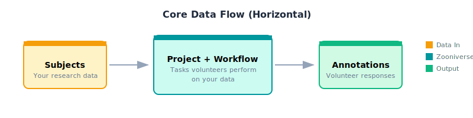

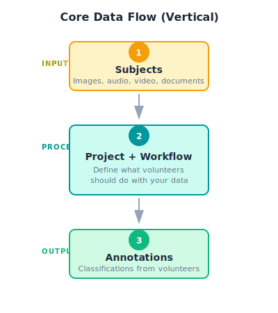

**Key takeaway:** Zooniverse transforms your **Subjects** (data) through **Workflows** (tasks) into **Annotations** (results). Everything else is optimization of this core loop.

---

## 2. Is Zooniverse Right For Me?

The most important question to answer before investing time in project setup. Use these decision frameworks to evaluate fit.

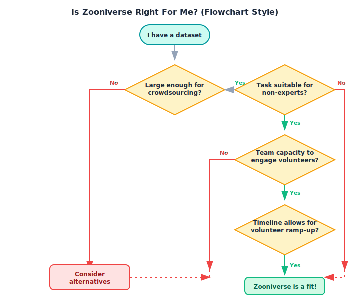

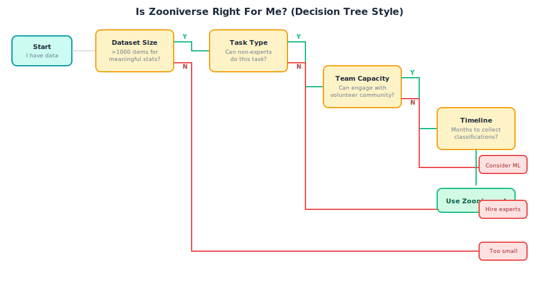

**Key questions to consider:**

1. **Dataset size:** Do you have enough items (typically 1,000+) to justify the setup overhead?
2. **Task suitability:** Can non-experts meaningfully contribute to your analysis?
3. **Team capacity:** Do you have resources to engage with the volunteer community?
4. **Timeline:** Can you accommodate weeks-to-months of data collection?

---

## 3. Dataset Evaluation Matrix

Not all datasets are equally suited for crowdsourcing. This matrix helps you understand where your data falls on the suitability spectrum.

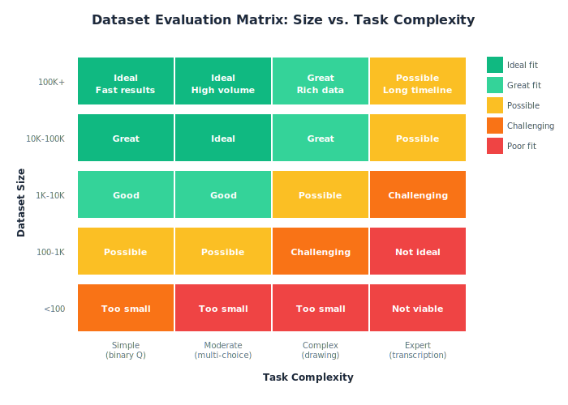

**How to read this:**

- **Rows:** Your dataset size (number of items to classify)
- **Columns:** How complex your task is
- **Colors:** Green = ideal fit, Yellow = possible with caveats, Red = likely poor fit

**Common patterns:**

- Large datasets with simple tasks: *Perfect for Zooniverse*
- Small datasets with complex tasks: *Consider expert annotation instead*
- Medium datasets with moderate tasks: *The sweet spot for most projects*

---

## 4. Task Decomposition

One of the most powerful optimizations: breaking complex tasks into sequences of simpler ones.

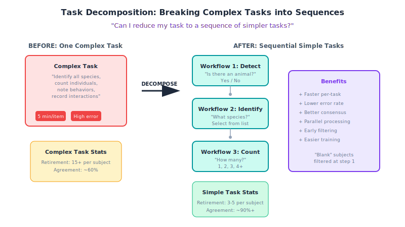

**Why decompose?**

- **Faster classification:** Simple yes/no questions take seconds, not minutes
- **Higher accuracy:** Focused tasks have better volunteer agreement
- **Early filtering:** Remove "blank" or uninteresting subjects before expensive analysis
- **Parallel processing:** Different volunteers can work on different stages simultaneously

**Example decomposition:**

| Complex Task | Decomposed Tasks |
|--------------|------------------|
| "Identify all species, count them, note behaviors" | WF1: "Any animals?" → WF2: "What species?" → WF3: "How many?" |

---

## 5. Who's Responsible for What?

Clear expectations for what you need to provide versus what the platform handles.

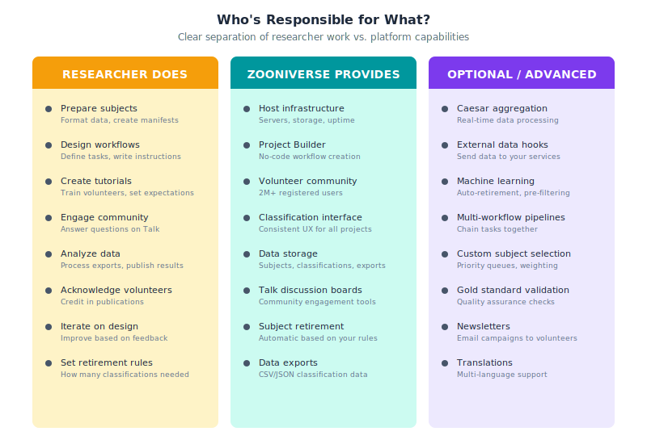

**Your critical responsibilities:**

1. **Data preparation:** Format subjects, create manifests, ensure image quality
2. **Workflow design:** Define tasks clearly, write unambiguous instructions
3. **Community engagement:** Respond on Talk, answer questions, show appreciation
4. **Data analysis:** Process exports, aggregate results, publish findings

**What Zooniverse provides:**

- Hosting infrastructure and volunteer community access
- Project Builder tools and classification interface
- Data storage, export, and (optionally) aggregation
- Discussion boards and community tools

---

## 6. Caesar: Real-time Data Processing

For projects that need automated actions without relying on machine learning.

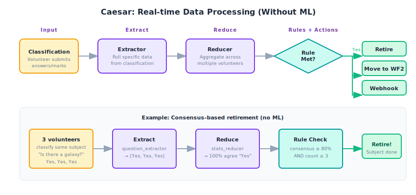

**What Caesar enables:**

- **Consensus-based retirement:** Stop showing subjects when enough people agree
- **Workflow advancement:** Move interesting subjects to more detailed analysis
- **Webhook notifications:** Trigger your own systems when rules are met
- **No ML required:** Pure logic based on volunteer consensus

**When to use Caesar:**

- You want subjects retired automatically (not manually)
- You need to move subjects between workflows based on results
- You want to integrate Zooniverse with external systems
- You don't want to download and process all data manually

---

## 7. External Service Integration

Zooniverse doesn't have to be an island. Here's how your systems can connect.

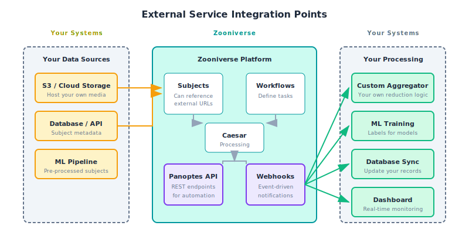

**Data In (your systems → Zooniverse):**

- Host subject media on your own S3/cloud storage
- Use the Panoptes API to upload subjects programmatically
- Pre-process data with ML before sending to volunteers

**Data Out (Zooniverse → your systems):**

- Webhooks for real-time notifications
- API access for automated export retrieval
- Caesar hooks for custom processing pipelines

---

## 8. Volunteer Engagement Cycle

Sustained volunteer engagement requires intentional effort throughout the project lifecycle.

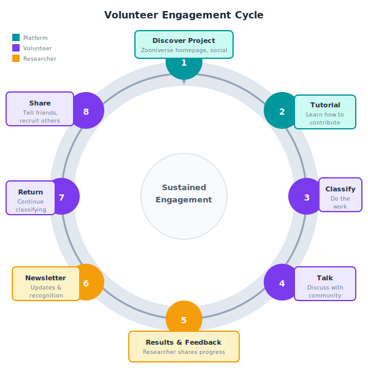

**The engagement loop:**

1. **Discover:** Volunteers find your project (homepage, social media, word of mouth)
2. **Learn:** Tutorial teaches them how to contribute effectively
3. **Classify:** They do the actual work
4. **Discuss:** Talk boards enable community and discovery
5. **Feedback:** You share results and progress updates
6. **Newsletter:** Periodic updates maintain connection
7. **Return:** Engaged volunteers come back
8. **Share:** Happy volunteers recruit others

**Your role in the cycle:**

- Provide clear tutorials (step 2)
- Engage actively on Talk (steps 4-5)
- Send updates via newsletters (step 6)
- Acknowledge contributions publicly (step 5)

---

## 9. Multi-Workflow Pipelines

Advanced technique for maximizing efficiency through progressive filtering.

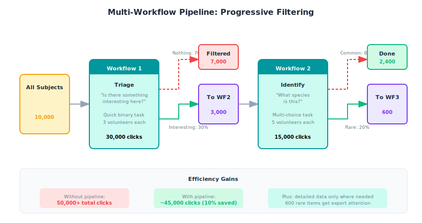

**How it works:**

1. **Triage workflow:** Quick binary question filters out uninteresting subjects
2. **Identification workflow:** Only interesting subjects get detailed analysis
3. **Expert workflow:** Only rare/unusual items get the most attention

**Benefits:**

- Reduces total classification effort (70% filtered at step 1)
- Focuses expensive tasks on valuable subjects
- Enables different retirement rules per workflow
- Creates natural subject prioritization

---

## 10. Output Options: Raw vs. Aggregated

Understanding what data you'll get and what it's best used for.

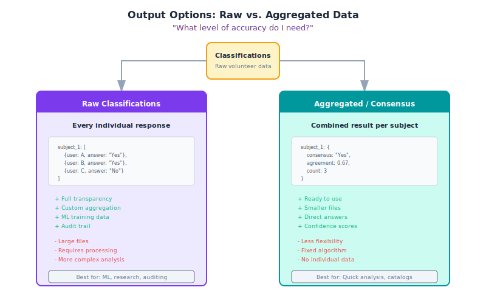

**Raw classifications:**

- Every individual volunteer response
- Best for: ML training, research papers, auditing, custom aggregation
- Tradeoff: Larger files, requires processing

**Aggregated/Consensus:**

- Combined result per subject (via Caesar or offline processing)
- Best for: Quick analysis, catalogs, immediate use
- Tradeoff: Less flexibility, fixed aggregation algorithm

**Questions to consider:**

- Do I need to train machine learning models? → Raw data
- Do I need an audit trail of individual responses? → Raw data
- Do I just need the final answer per subject? → Aggregated
- Am I building a catalog or database? → Aggregated

---

## Next Steps

Based on your evaluation:

| If... | Then... |
|-------|---------|
| Zooniverse is a good fit | Start with [Getting Started](../getting-started/index.md) |
| You need transcription | See the [Transcription Project Guide](../transcription-project-guide/index.md) |
| You're ready to build | Go to [Project Builder](https://www.zooniverse.org/lab) |
| You need help deciding | [Contact the Zooniverse team](https://zooniverse.org/about/contact) |

---

*This guide was developed from brainstorming sessions with Lucy and Travis on helping researchers evaluate Zooniverse fit from a heuristic decision-tree perspective.*
