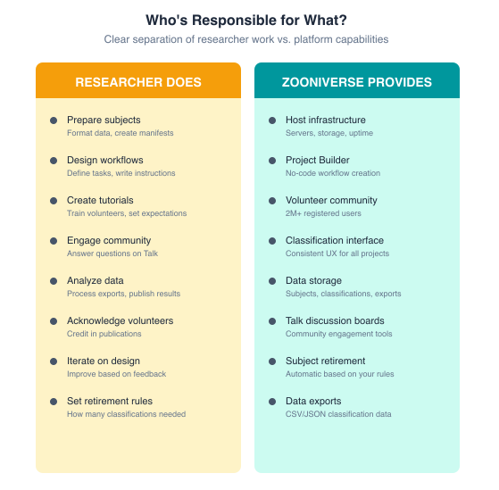

# **Using Zooniverse**

Whether you’re exploring if Zooniverse is the right fit for your research or you’re ready to begin building a project, this Help Center is here to guide you through the process.

**Explore the Help Center**

* [**Getting Started**](getting-started/index.md) introduces the Zooniverse platform, project and platform policies, the project review and launch process, and provides step-by-step guidance for using the Project Builder.  
* [**Best Practices**](best-practices/index.md) shares lessons learned from years of supporting research teams across disciplines as they build, launch, and sustain successful projects and participant communities.  
* [**Beyond the Basics**](next-steps/index.md) highlights more advanced platform features and workflows to explore once you are comfortable with the fundamentals, including tools for improving classification efficiency, analyzing data, and integrating Zooniverse within broader research infrastructure.  
* [**Transcription Project Guide**](transcription-project-guide/index.md) provides guidance and recommendations specifically for transcription-based projects.  
* [**Glossary**](glossary.md) defines commonly used Zooniverse terms and concepts.

## **Is Zooniverse Right for My Project?**

Anyone can use the Zooniverse Project Builder platform to create a crowdsourced research project. Projects may be private or public and shared with a specific community or broader audience. We review all projects for appropriateness and reserve the right to remove content that violates platform policies. See [Lab Policies](https://help.zooniverse.org/getting-started/lab-policies/#zooniverse-policies) and [Project Types](https://help.zooniverse.org/getting-started/lab-policies/#how-to-launch-your-project) for details.

If you would like your project promoted to the full Zooniverse community, you can apply to become an **Official Zooniverse Project**. Official projects are featured on our [Projects page](http://zooniverse.org/projects) and shared with volunteers via e-newsletters and social media channels. To become official, projects must complete review by the Zooniverse team as well as by volunteer beta testers. For details about the review and beta testing process, see [Project Review](https://help.zooniverse.org/getting-started/lab-policies/#project-review). For information about the criteria required for an Official Zooniverse project, see [Lab Policies](https://help.zooniverse.org/getting-started/lab-policies/#zooniverse-policies).

## **Participants Make Zooniverse Possible**

Millions of volunteers around the world contribute to Zooniverse projects, enabling research that would otherwise be impractical or impossible. Successful projects center participant engagement as an essential part of the research process.

Project teams are expected to actively engage with participants throughout the project lifecycle, including through the Talk discussion forum and project newsletters. Before launching a project, teams should ensure they have the capacity to support and communicate with their participant community. For guidance, see the [Launch Rush](best-practices/2-launch-rush.nmd) and [Long Haul](best-practices/3-long-haul.md) best practice sections.

## **Who is responsible for what?** 

Zooniverse provides the platform and supporting infrastructure, and the Zooniverse team draws on its experience to provide guidance, recommendations, and lessons learned related to project design, participant engagement, and project management. Project teams are responsible for designing and managing their project, engaging their participant community, and interpreting and using their project data and results.  

As a grant-supported research and public engagement initiative, Zooniverse balances community needs, available resources, and long-term sustainability in shaping development priorities and support capacity.

## **Zooniverse Within the Broader Research Ecosystem**

Zooniverse is often one component within a larger research workflow and cyberinfrastructure ecosystem. Visit the [Integrations](next-steps/integrations.md) page to explore various ways that projects connect Zooniverse with external tools, databases, analysis pipelines, and research infrastructure.

## **Next Steps**

| If you… | Then… |
| :---- | :---- |
| Are evaluating whether Zooniverse is a good fit | Start with [Getting Started and Lab Policies](getting-started/lab-policies.md) |
| Are ready to build a project | Visit the [Project Builder Guide](getting-started/index.md) |
| Are planning a transcription project | Visit the [Transcription Project Guide](transcription-project-guide/index.md)  |
| Want to see an example project build | Explore the [sample project walk through](getting-started/example.md) |
| Want to explore existing Zooniverse projects | Visit the [Projects page](https://www.zooniverse.org/projects) |
| Need guidance or support | [Contact the Zooniverse team](https://www.zooniverse.org/about#contact) |
