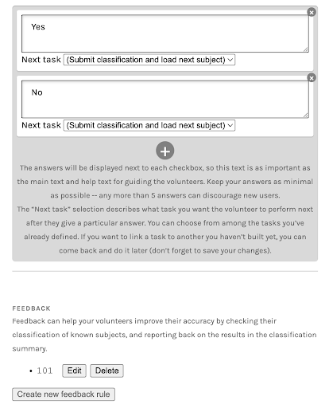
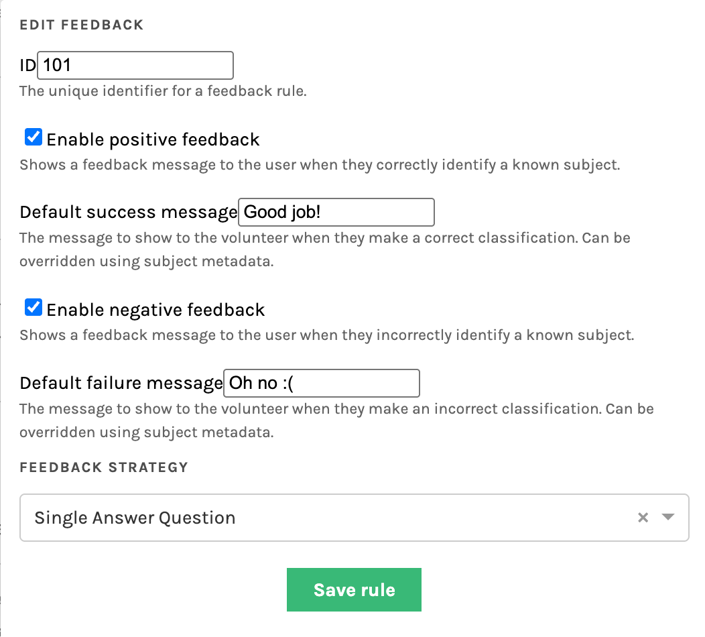

# Feedback

The **Feedback** functionality in Zooniverse allows project teams to provide volunteers with immediate guidance when they classify designated *training subjects*. This helps participants learn as they go and improves the quality of collected data.  When a volunteer classifies a training subject, the system can show whether their answer was correct along with customizable success or failure messages. **Feedback** is configured per Workflow and can be used with certain tasks (including question, survey, and drawing tasks).


## Setting Up Feedback in a Workflow

Feedback can be configured on the **Workflow** page in the Project Builder. Follow these steps to set it up:

1. Open your workflow and navigate to the **Feedback** section under your question options.  
   - This section appears below your question’s possible answers.  
   - For example, in a yes/no task setup (see below), you’ll see where feedback rules can be added.

2. Select **Create new feedback rule** to open the configuration panel.  

3. Enter a unique **Feedback Rule ID** — this can be any number, but you’ll need to reference it later when uploading your training subjects.  

4. Enable **positive** and/or **negative feedback**, and enter default messages for each.  
   - These messages will be shown to volunteers when they correctly or incorrectly classify a known training subject.  
   - You can later override these defaults by specifying custom messages in subject metadata.

5. Choose a **Feedback Strategy**, such as *Single Answer Question* (recommended for yes/no tasks).

Once configured, click **Save rule** to apply your settings. You can edit or delete the rule later if needed.

|  |  |
| :---: | :----: |
| *Figure 1. Example of a question task setup with feedback section visible below answer options.* | *Figure 2. Example of a feedback rule setup showing success and failure messages for positive and negative feedback.* |


## Creating a Training Subject Set

Feedback requires specifying a **Training Subject Set**, which contains examples for which the correct answers are already known. These are the subjects that will be used to provide feedback to volunteers during classification. When uploading or editing these subjects, you will need to include feedback-specific metadata fields in the [subject manifest](https://help.zooniverse.org/getting-started/example/#details-subject-sets-and-manifest-details-aka-what-is-a-manifest). 

### Feedback Strategies

The exact metadata you need to upload depends on the task type. Below, we show the metadata required for single-answer question tasks and provide links to additional resources for other task types.

For single-answer question tasks, this strategy will determine whether the user correctly answered a single question, or, alternatively, if no answer was provided. A single subject can have multiple feedback rules. To group the metadata fields for a single feedback rule together, N should be an integer that is identical for each rule, e.g.:

| Metadata Field | Description |
|----------------|-------------|
| `#training_subject` | Set to `true` to mark this subject as a training subject. |
| `#feedback_N_id` | The feedback rule ID (matches the workflow configuration). |
| `#feedback_N_answer` | The correct answer index (e.g., "0" for "Yes", "1" for "No"). |
| `#feedback_N_successMessage` | *(Optional)* Custom message when the volunteer classifies correctly. |
| `#feedback_N_failureMessage` | *(Optional)* Custom message when the volunteer classifies incorrectly. |


*Note:* Feedback answer indices must be **strings** when uploaded through the API (e.g., `'0'` not `0`).

#### All Task Types

Above is the metadata required for single-answer question tasks. You can also find this documented in the [FEM GitHub](https://github.com/zooniverse/front-end-monorepo/blob/master/packages/lib-classifier/src/store/feedback/strategies/single-answer-question/README.md#feedback-strategy-single-answer-question).

All strategies share a common set of keys: `#feedback_N_id`, `#feedback_N_successMessage` (optional), `#feedback_N_failureMessage` (optional), `#training_subject` (optional, used by Caesar)

Other task types / strategies use other keywords; please refer to the linked documentation resources for complete details:

- [Single Answer Question](https://github.com/zooniverse/front-end-monorepo/blob/master/packages/lib-classifier/src/store/feedback/strategies/single-answer-question/README.md): `#feedback_N_answer`
- [Simple Survey](https://github.com/zooniverse/front-end-monorepo/blob/master/packages/lib-classifier/src/store/feedback/strategies/survey/simple/README.md): `#feedback_N_choiceIds`
- [Radial Drawing](https://github.com/zooniverse/front-end-monorepo/blob/master/packages/lib-classifier/src/store/feedback/strategies/drawing/radial/README.md): `#feedback_N_x`, `#feedback_N_y`, `#feedback_N_tolerance` (optional)
- [Graph2dRange Drawing](https://github.com/zooniverse/front-end-monorepo/blob/master/packages/lib-classifier/src/store/feedback/strategies/datavis/graph2drange/README.md): `#feedback_N_x`, `#feedback_N_width`, `#feedback_N_tolerance` (optional)
- [Empty Annotation ("dud")](https://github.com/zooniverse/front-end-monorepo/blob/master/packages/lib-classifier/src/store/feedback/strategies/dud/README.md): No addition keys


### Example: Uploading Subjects via Code

Here’s a simple example of how to upload training subjects programmatically using the Panoptes Python client:

```python
project_id = 0000
subject_set_id = 000000
feedback_id = 101  # Must match workflow feedback rule ID

metadata_yes = {
    '#training_subject': 'true',
    '#feedback_1_id': feedback_id,
    '#feedback_1_answer': '0',  # Correct answer (string)
    '#feedback_1_successMessage': "Correct!",
    '#feedback_1_failureMessage': "Oops! Try again."
}

metadata_no = {
    '#training_subject': 'true',
    '#feedback_1_id': feedback_id,
    '#feedback_1_answer': '1',
    '#feedback_1_successMessage': "Correct!",
    '#feedback_1_failureMessage': "Not quite right!"
}

subject_set = SubjectSet.find(subject_set_id)

for each_subject in training_subjects_no:
    s = Subject()
    s.links.project = project_id
    s.add_location(str(each_subject))
    s.metadata = metadata_no
    s.save()
    s.reload()
    subject_set.add(s)

for each_subject in training_subjects_yes:
    s = Subject()
    s.links.project = project_id
    s.add_location(str(each_subject))
    s.metadata = metadata_yes
    s.save()
    s.reload()
    subject_set.add(s)
```

This example uses shared success/failure messages for simplicity, but we recommend customizing them per subject to provide helpful information to the volunteer.


## Training Strategy and Probability

The training strategy determines how frequently volunteers are shown training subjects as they progress through classifications. This helps balance early guidance with independent classification as users gain experience.

### Configuration Parameters

Training behavior is controlled via workflow configuration variables:

- **`training_set_ids`** – identifies which subject sets contain training subjects
- **`training_chances`** – an array of probability values used to determine frequency at which training subjects are shown. A value is selected from this array using the index derived from a user's seen subjects count for the workflow
- **`training_default_chance`** – the fallback probability used when no array-based values are available or when the user has exceeded the array length

Workflow parameters can be configured via the Panoptes Python client by project owners and collaborators. See [this script](https://github.com/zooniverse/Data-digging/blob/master/scripts_Utility/configure_training_subjects.py) in the [Data-digging repository](https://github.com/zooniverse/Data-digging) for implementation examples of client commands.


### Example Configuration

In the following example, volunteers have a 50% chance of receiving a training subject for their first 10 classifications, which gradually decreases over time. After 100 classifications, the default rate (5%) is applied.

```python
from panoptes_client import Panoptes, Workflow

puser = <ZOONIVERSE_USERNAME>
ppswd = <ZOONIVERSE_PASSWORD>

workflow_id = 999999
training_set_ids = [888888, 777777]

# 10 classifications at 50% probability, then 40 at 20%, then 50 at 10%
training_chances = (10 * [0.5]) + (40 * [0.2]) + (50 * [0.1])
training_default_chance = 0.05  # After 100 classifications

Panoptes.connect(username=puser, password=ppswd)

w = Workflow.find(workflow_id)
w.configuration['training_set_ids'] = training_set_ids
w.configuration['training_default_chance'] = training_default_chance
w.configuration['training_chances'] = training_chances
w.configuration['subject_queue_page_size'] = 4
w.save()
```

This tapering strategy allows teams to introduce volunteers to known examples early on while reducing training frequency as they become more confident and consistent.


