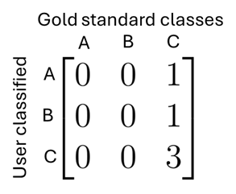
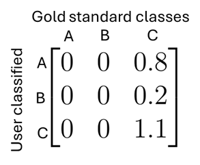
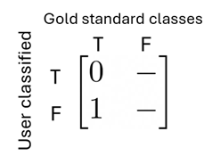
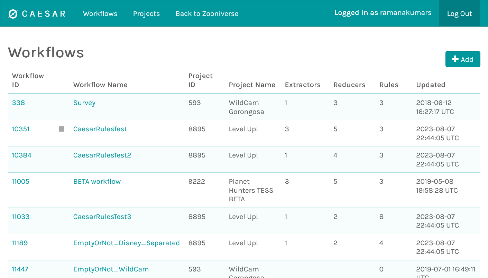
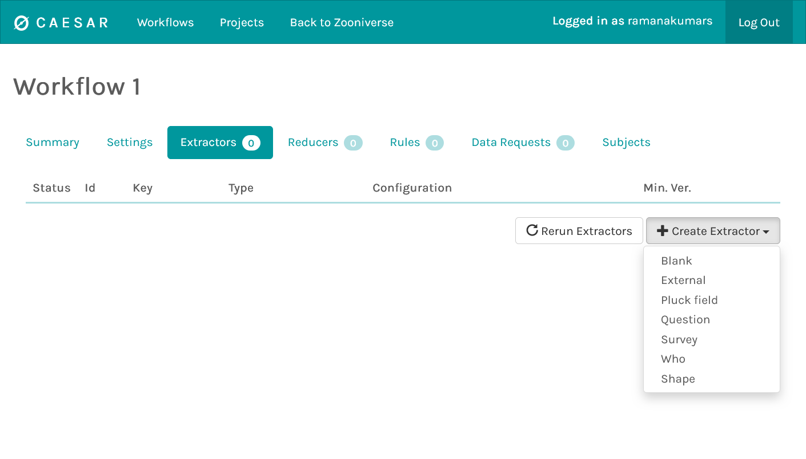
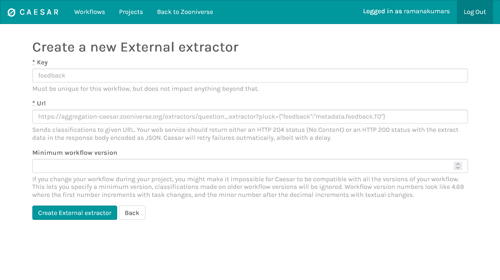
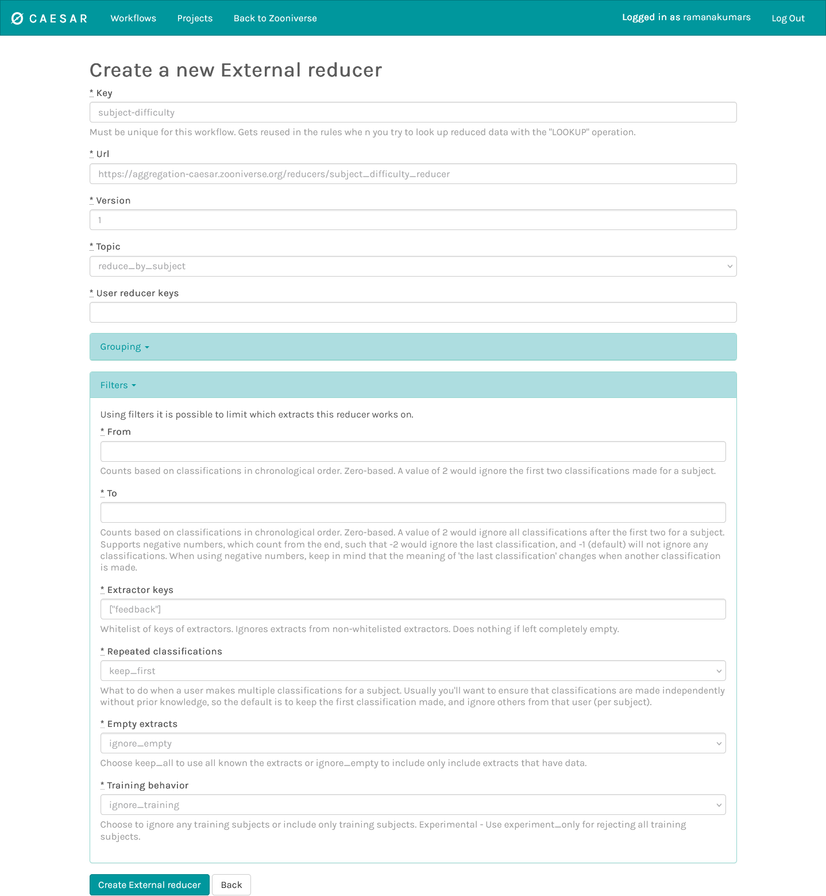
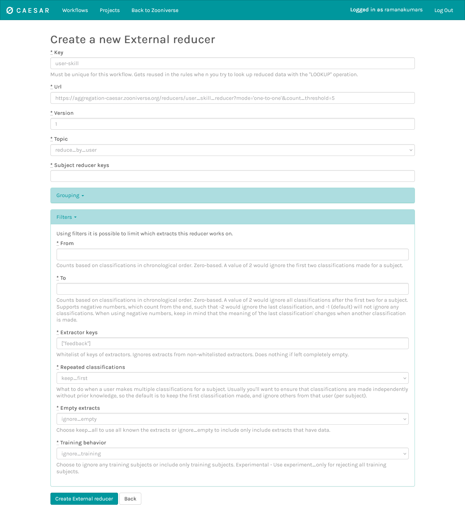

# Leveling-Up framework for using volunteer skill

The leveling up (LU) framework is a method to track the skill of a volunteer and the difficulty of individual subjects (through the [feedback](/next-steps/feedback) mechanism). This allows the research team to gate more difficult subjects to higher skill volunteers, and provide a method to level up the volunteers through classification of gold standard subjects.

## Overview

The leveling up framework uses the feedback framework to measure volunteers' classification accuracy on gold standard subjects. These subjects will need to be seeded by the research teams and will essentially be a set of expert classifications that will be used to validate the volunteer responses.

The data from the feedback system is used in two ways:

1. To calculate the difficulty of the subject: defined as the ratio of successful classifications by multiple volunteers over the total number of classifications of that subject. Therefore, more difficult subjects are weighted less when counting against a volunteer's incorrect classification and weighted more when counting for a volunteers' correct classification of that subject. 
2. To calculate the user skill: defined as the ratio of correct classifications across all subjects by that user to the total number of gold standard classifications. This can be done in either a class-specific context, so that we can retrieve the user skill per class or in a binary form which just returns the total user skill for that workflow. In both cases, the ratio is weighted by the subject difficulty as defined above.

The user skill is determined by calculating a per-class confusion matrix (for a binary problem the classes are just True/False), and the per-class user skill is determined by collapsing the confusion matrix per class.

Let's take an example of a multi-class problem. Suppose a subject set has 4 classes (A, B, C). Then the user skill is calculated using a 3x3 confusion matrix. For simplicity, let's assume that this user has only seen gold standard subjects with class C, and out of 5 subjects, they classified 3 correctly as class C and the other two as classes A and B respectively. Therefore, their confusion matrix will be as follows:

Let's say that the 5 subjects have the following difficulties:

1. Subject 1: user correctly classified as class C. 60% of the volunteers correctly classified.
2. Subject 2: user correctly classified as class C. 40% of the volunteers correctly classified.
3. Subject 3: user incorrectly classified as class A. 80% of the volunteers correctly classified.
4. Subject 4: user incorrectly classified as class B. 20% of the volunteers correctly classified.
5. Subject 5: user correctly classified as class C. 90% of the volunteers correctly classified.

In this case, Subject 1 and 2 have medium difficulties with this user correctly identifying them. Subject 3 is an "easy" subject since many volunteers correctly identified it but this user did not. Subject 4 is a difficult subject which many volunteers got incorrect and Subject 5 is an easy subject which many volunteers identified correctly, including this user. Therefore, this in this case the subject difficulties for each subject will be:

1. Subject 1: 0.4
2. Subject 2: 0.6
3. Subject 3: 0.8
4. Subject 4: 0.2
5. Subject 5: 0.1

This calculation increases the weight of correct classifications of difficult subjects (e.g., Subject 2) and incorrect classifications of easy subjects (Subject 3) by inverting the difficulty of correct classifications (`1 - subject_difficulty`). Therefore, the new subject difficulty weighted confusion matrix is:

Summing over the columns, we get the user skill for class C to be `1.1 / (1.1 + 0.8 + 0.2) = 52.3%`.

For a binary task, the confusion matrix is 2x2. Since we only compare feedback against positive expert classifications, the second column is blank. We can proceed similarly with the calculation of the subject difficulty to calculate the user skill.

## Pre-requisites

The LU framework is an advanced system that touches multiple subsystems in Zooniverse and therefore has a strict set of pre-requisites:

1. The project must be on FEM to leverage the [feedback](/next-steps/feedback/) capabilities 
2. You must have a selection of gold standard subjects with expert classifications. The number of subjects will depend on how quickly you want volunteers to level up and how many separate levels you need in your project
3. You must have [Caesar](/next-steps/caesar-realtime-data-processing/) set up to handle real-time data aggregation
4. You must have a Question or Survey task. Currently leveling up is limited to only these two tasks.

## Setting up the Leveling Up framework

### Step 1. Create Project via Project Builder

1. Reach out to a Zooniverse contact to activate tools for Leveling Up
2. Create Subject Sets. Note that: 
    1. the subjects will need specific columns to work with feedback). 
    2. make sure to upload your gold standard subjects with the `#training-subjects` column to ensure that they are not aggregated

### Step 2: Create Workflows via Project Builder: Levels 1, 2, 3, etc
1. Reach out to a Zooniverse contact to set Workflow Config: `level`=1, etc for each level
2. Create your task: for now we only support the Question and the Survey tasks (note task key – default assumption is “T0”)
3. Add Feedback Rules (sync feedback rule IDs with subject metadata key names)
4. Link Subject Sets to workflow, and note the workflow ID for the next step.

### Step 3: Create & Configure Workflows on Caesar
First, create the workflows on Caesar. Visit https://caesar.zooniverse.org/workflows, click “+ Add” button in the upper right corner of the page and enter your workflow ID from the project builder page.

#### Set up the extractors (choose your workflow from Caesar and go to the Extractors tab):
First, we need to extract the feedback from gold standard subjects to calculate the subject difficulty. To set this up:

1. Click on "Create Extractors" and  select "External"

2. Provide a key for this extractor (e.g., "feedback")
3. Use this URL: `https://aggregation-caesar.zooniverse.org/extractors/question_extractor?pluck={"feedback":"metadata.feedback.T0"}`. Be sure to change the `T0` to your task defined in the project builder.

You may continue to add other extractors as needed for the project!

#### Set up the reducers
Go to the reducers tab and set up two reducers. One will be to calculate the subject difficulty and the other to calculate user skill.

##### Subject difficulty reducer
1. Click on "Create Reducers" and  select "External"
2. Provide a key for this extractor (e.g., "subject-difficulty")
3. Use this URL: `https://aggregation-caesar.zooniverse.org/reducers/subject_difficulty_reducer`
4. Click on Filters and type in the feedback extractor we set up previously enclosed in `[]`: `["feedback"]`
5. Click on Empty extracts and select `ignore_empty`. Your configuration should like the one below:

##### User skill reducer
1. Click on "Create Reducers" and  select "External"
2. Provide a key for this extractor (e.g., "user-skill")
3. Click Topic and select `reduce_by_user`
4. Set up the URL changing the parameters in the `[]` as needed (see [choosing parameter](#choosing-parameters) for more details): 

`https://aggregation-caesar.zooniverse.org/reducers/user_skill_reducer?mode=[mode]&skill_threshold=[skill_threshold]&count_threshold=[count_threshold]&strategy=[strategy]`

5. Click on Filters and type in the feedback extractor we set up previously enclosed in `[]`: `["feedback"]`
6. Click on Empty extracts and select `ignore_empty`. Your configuration should like the one below:

7. Contact a Zooniverse team member to set up advanced routing between your subject difficulty and the user skill reducer. Be sure to note the names of the reducers and the workflow ID.

### Step 4: Creating rules and leveling up volunteers

Since these strategies can depend heavily on your workflow and task, please reach out to a Zooniverse contact at this stage to determine how to set up bothe promotion of the volunteer and user skill-weighted subject retirement rules.

## Choosing parameters
There are three main parameters to choose when setting up the user skill calculation:

### User skill calculation mode
The user-skill calculation mode (`mode`): the skill is calculated per class/label in the input data so this choice tells the reducer how to calculate the confusion matrix. There are three options for this:

1. a `binary` mode: where the confusion matrix is just calculated against a "correct" classification as defined by the feedback rules to produce a total user skill.
2. a `one-to-one` mode, where each classification can only produce one label (e.g., a single answer question task). In this case the feedback rules produce a "correct/incorrect" classification along with a expert class label and volunteer class label. This will build a simple confusion matrix based on the volunteer/expert classes.
3. a `many-to-many` mode, where each classification can have multiple labels (e.g., a survey task). In this case we compare all classes in the expert classification against all classes in the volunteer classification. Labels that exist in the volunteer classification but not in the expert classification are compared against a "NULL" class and are essentially treated as an incorrect classification.

Based on your task and how you want to measure the user skill, you can choose individual modes.

### Skill threshold for leveling up a volunteer
To make sure that the volunteer has reached a sufficient skill, we can set a threshold skill value before leveling up the volunteer. This value can be set per-skill or for an overall class (see [Leveling up Strategy](#leveling-up-strategy) below). The default value is 0.7 (i.e., the volunteer must get 70% of the gold standard classifications correct before leveling up).

### Count threshold for leveling up a volunteer
To make sure that the volunteer has done enough gold standard classifications to get an accurate skill, we can set a threshold on the number of classifications (per-class). The default value is 10 (i.e., each class in the gold standard dataset must be seen atleast 10 times before we check the volunteer skill for leveling up). Change this parameter as needed to modify the rate at which the volunteers should level up.

### Leveling up strategy
To validate the skill of the volunteer against the threshold, there are two options:

1. `strategy=mean` calculates the average skill across all the classes and checks against the count threshold. If the skill and counts are above the threshold we determine that the user should be leveled up to the next level.
1. `strategy=all` checks the skill and count of each class against their respective threshold. This is more restrictive since it requires the volunteer to have an equally good skill across all the classes.

### Optional parameters
To restrict the classes you want to check against for leveling up, you can set the `focus_classes` parameter which is a list of classes that will be used to determine whether a user should be leveled up. Note that the user skill calculation still happens across all classes in the dataset, so this only affects the leveling up strategy defined above.

The null class can be set (if needed) using the `null_class` parameter which takes in a string for the label of the null class. This is not used in the binary or the one-to-one mode.

## Troubleshooting
Here are some common problems:

1. If the extractor/reducers are failing: did you enable feedback on the Panoptes workflow? If not, Caesar reducers will fail because feedback key will be missing, causing all reducers to fail.
2. If you're not seeing the user skill calculation fail: did you get a Zoo admin to set the `subject_reducer_keys` for the relevant reductions on the user skill reducer?
3. If you are seeing a red cross on the Caesar configuration: are all extract and reducer keys spelled correctly, both on the extract / reducer itself, but also in the filter config?
4. If you're not seeing the level up messages: are the `level` keys set up on the individual Panoptes workflows? If not, the frontend display of workflow buttons will no display / restrict access correctly.

If you have other issues with your configuration, please reach out to Zooniverse helpdesk and we can help you go over the configuration.
